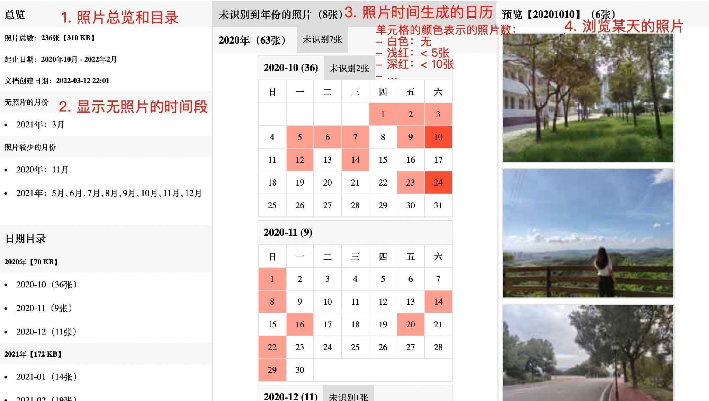

# 照片整理工具

> 最近整理了多年以来积攒的照片，过程中没找到很合适的工具来解决需求，便自己动手写了一番。后面把总结的方法融入到代码中，添加了通过命令行运行的脚本，分享出来希望也能解决你的问题。

照片太多时，在整理过程中你是否也遇到过下面这些问题：

1. 存储的目录很多，记不清哪些时光是有趣的，哪一段时间的照片丢失变成了空白；
2. 有很多重复照片，但没有什么好的方法快速找出来进行清理；
3. 定期导出手机照片到电脑上备份，每次都得仔细的排除上次已备份的照片；
4. 照片文件越来越大（快10MB），但多数照片都不需要保存太高分辨率；

针对上面这些问题，已经实现了这些工具来解决问题：

1. 根据照片的拍摄时间生成日历，用日期查看的相册；
2. 根据 文件尺寸 + 文件名 + MD5 三个维度快速找出重复文件的工具；
3.  使用 adb 同步手机照片，能快速进行增量备份和进度展示的工具；
4.  可方便的修改图片压缩参数，且不丢失 EXIF 信息的缩减尺寸工具；

## 工具介绍

### 一、日历相册生成工具

解析照片名称中的日期渲染到日历上，如白色格子表示无照片，浅色格子表示低于5张。此外汇总照片信息，计算有丢失照片的月份，最终生成单个 HTML 文件在浏览器中预览。效果如下：



运行脚本和参数说明（源：src/java/task/PhotosCalendarTask.java）：

```shell
./runPhotosCalendarTask.sh /xxx/index.html /xxx/photosDir1/ /xxx/photosDir2/
```

- 参数1（/xxx/index.html）： 导出的 HTML 文件路径（可选，默认导出在照片目录下）
- 参数2+（/xxx/photosDir1/）：照片目录，支持多个

### 二、重复文件清理工具

扫描目录下的全部文件，对有相同文件大小的计算MD5确定重复。为了减少耗时提高效率，当文件大小相同且文件名也相同时认为重复文件，并输出中输出进度情况。

命令行运行示例（图片源为：./PhotosProducer/example/）：

```log
TEMP: md5=008cfef91391d8d09b000bfb6863118d, size=3 KB, file=/photos2021/IMG_20201010_144640.jpg
TEMP: md5=008cfef91391d8d09b000bfb6863118d, size=3 KB, file=/photos2022/C65_2021-05-29.jpg
Progress: (10/10) same size: [/photos2020/IMG_20201010_144640.jpg, /photos2021/C65_2021-05-29.jpg]
========================
Delete: /Users/xxx/PhotosProducer/example/photos2021/2021-04-13_IMG_38.jpg, 3 KB
Delete: /Users/xxx/PhotosProducer/example/photos2021/2021_IMG_55.jpg, 3 KB
Delete: /Users/xxx/PhotosProducer/example/photos2022/1644643310000.jpg, 3 KB
上列 229 个重复文件，共占用存储 300 KB，输入 del 进行删除，输入其它退出程序：
```

运行脚本和参数说明（源：src/java/task/DuplicateFileCleanTask.java）：

```shell
./runDuplicateFileCleanTask.sh  /xxx/inputDir/ /xxx/report.txt
```

- 参数1（/xxx/inputDir/）： 需要去重的图片目录
- 参数2（/xxx/report.txt）：重复文件的文本报告（可选）

### 三、手机照片同步工具

需要手机上打开了「开发者模式」，且电脑上有安装 [adb (Android Debug Bridge)](https://developer.android.google.cn/studio/command-line/adb) 工具。通过 `ls -al` 命令获取手机中照片的名称和大小，然后 `adb pull` 拉取照片，将拉取成功的照片名称记录到日志文件，下次再去读日志做到增量同步。

运行脚本和参数说明（源：src/java/task/SyncPhotosTask.java）：

```shell
./runSyncPhotosTask.sh  /xxx/outputDir/ /xxx/PhoneFile.log /sdcard/DCIM/CameraXXX
```

- 参数1（/xxx/outputDir/）： 导出到电脑端的目录
- 参数2（/xxx/PhoneFile.log）：已导出的照片日志文件，用于增量同步
- 参数3+（/sdcard/DCIM/CameraXXX）：手机中照片的目录，支持多个（可选）
	
	```java
	// 已内置的手机照片目录
	"/sdcard/DCIM/Camera",
	"/sdcard/DCIM/Screenshots",
	"/sdcard/tencent/MicroMsg/WeiXin",
	"/sdcard/Picture/知乎",
	"/sdcard/Tencent/QQ_Images",
	```

### 四、图片尺寸缩减工具

减少图片文件大小主要有两种方法：降低画质，通过优化压缩算法，处理后通常人眼很难察觉，多数照片实测能节省 60% 的存储空间，如在 MacOS 上用的 [ImageOptim](https://github.com/ImageOptim/ImageOptim) 工具；降低尺寸，如将手机上 (5000\*4000) 的分辨率，裁减为 2K(2048\*1024) 分辨率，处理后图片无法再 4K 高清显示，但能节省 90%+ 的存储空间。这里提供降低尺寸的工具，依赖 [Scalr](https://github.com/rkalla/imgscalr) 库和 `javax.imageio` 的底层能力，并保持 EXIF 信息不丢失。

运行脚本和参数说明（源：src/java/task/ReduceImageSizeTask.java）：

```shell
./runReduceImageSizeTask.sh /xxx/inputDir/ /xxx/outputDir/
```

- 参数1（/xxx/inputDir/）：需要缩减尺寸的照片目录
- 参数2（/xxx/outputDir/）：缩减尺寸后的照片存放目录（可选，为空时覆盖原图）


